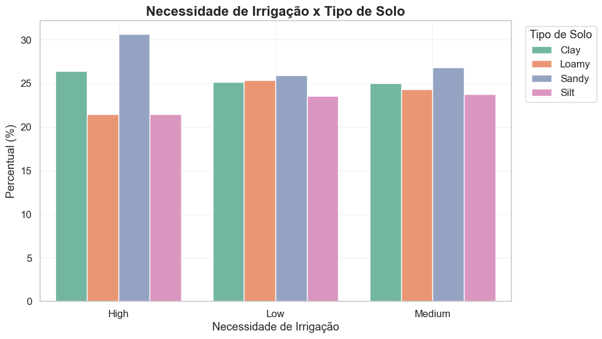
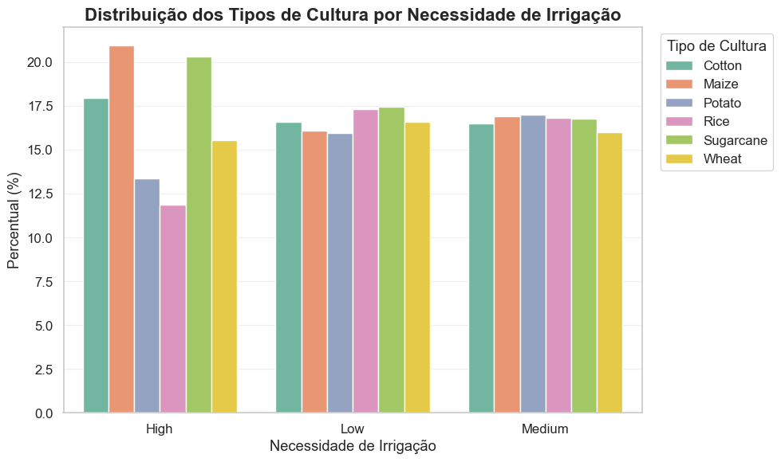
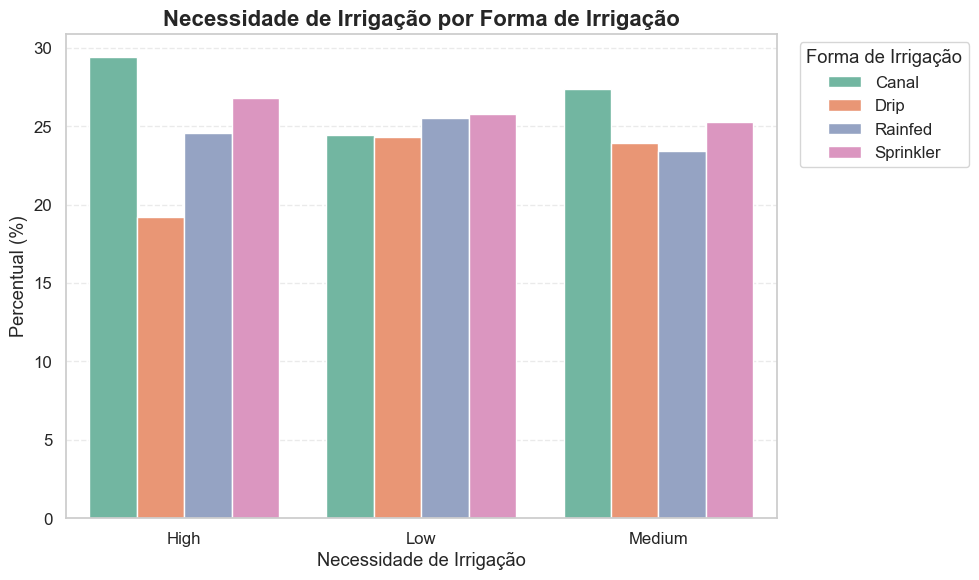
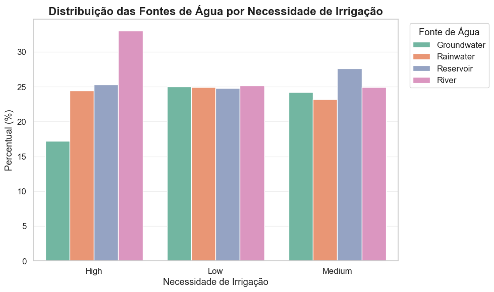
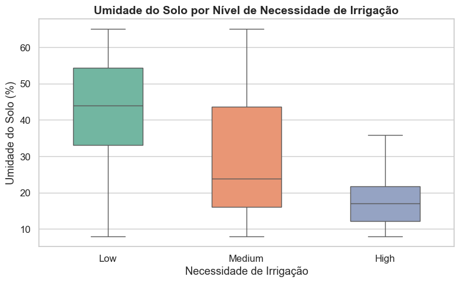
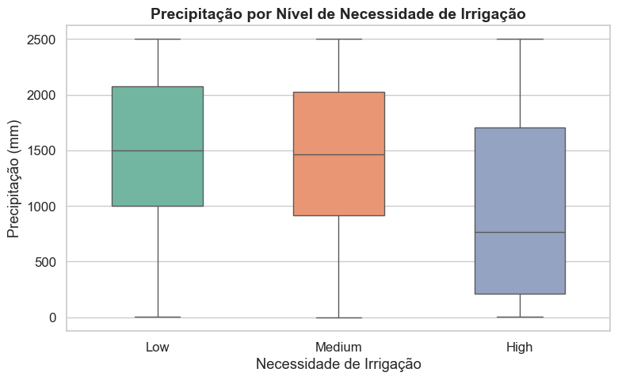
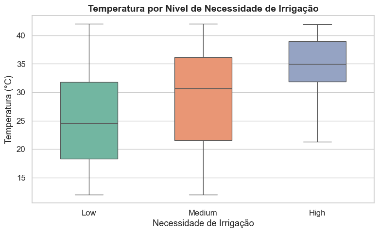

# Análise Exploratória dos Dados

## Objetivo

Nesta etapa foi realizada uma Análise Exploratória dos Dados (AED) com o objetivo de compreender a distribuição das variáveis e identificar quais características apresentavam associação com a necessidade de irrigação.

As variáveis foram divididas em dois grupos:

- Variáveis categóricas nominais;
- Variáveis quantitativas contínuas.

A partir dessa análise, foram selecionadas as variáveis que apresentaram maior potencial explicativo para a construção do modelo estatístico.

---

# Variáveis Categóricas Nominais

As variáveis categóricas foram avaliadas por meio de tabelas de contingência e gráficos de barras, permitindo comparar a distribuição dos níveis de irrigação entre as diferentes categorias.

## Necessidade de Irrigação × Tipo de Solo

{fig-align="center" width=80%}

O tipo de solo Sandy (Arenoso) é o que necessita maior irrigação, seguido pelo solo Clay (Argiloso), enquanto o solo Silty (Siltoso) e Loamy (Franco) apresentam menor necessidade de irrigação.

---

## Necessidade de Irrigação × Tipo de Cultura

{fig-align="center" width=80%}

O tipo de cultura apresentou comportamento diferente quanto à necessidade de irrigação, onde Milho e Cana de Açúcar apresentaram maior necessidade de irrigação, enquanto Arroz apresentou menor necessidade.

---

## Necessidade de Irrigação × Forma de Irrigação

{fig-align="center" width=80%}

Os diferentes métodos de irrigação apresentaram distribuições distintas entre as categorias da variável resposta, em que o método por canal junto com o método por aspersão apresentam maior necessidade de irrigação.

---

## Necessidade de Irrigação × Fonte de Água

{fig-align="center" width=80%}

A distribuição observada mostra que a água utilizada de rios apresenta o maior gasto em irrigação, enquanto água retirada de poços apresenta menor gasto.

---

# Variáveis Quantitativas

As variáveis quantitativas foram avaliadas por meio de boxplots, permitindo comparar suas distribuições entre os diferentes níveis de irrigação.

## Umidade do Solo × Necessidade de Irrigação

{fig-align="center" width=75%}

A umidade do solo apresentou diferenças entre as categorias de irrigação, indicando que solos com menor umidade podem apresentar maior necessidade de irrigação, enquanto uma boa umidade pode reduzir a necessidade de irrigação.

---

## Precipitação × Necessidade de Irrigação

{fig-align="center" width=75%}

Os níveis de precipitação apresentaram comportamento distinto entre as classes da variável resposta, indicando que quanto menor a quantidade de chuvas na área, maior é a necessidade de irrigação do solo.

---

## Temperatura × Necessidade de Irrigação

{fig-align="center" width=75%}

A temperatura apresentou diferenças na distribuição entre os grupos analisados, indicando que solos com temperaturas mais elevadas podem apresentar maior necessidade de irrigação.

---

# Síntese dos Resultados

A análise exploratória permitiu identificar as variáveis com maior associação à necessidade de irrigação.

| Grupo | Variáveis selecionadas |
|:------|:-----------------------|
| **Categóricas Nominais** | Tipo de Solo, Tipo de Cultura, Forma de Irrigação e Fonte de Água |
| **Contínuas** | Umidade do Solo, Precipitação e Temperatura |

---

# Considerações Finais

Os resultados obtidos nesta etapa serviram de base para a seleção das variáveis utilizadas no modelo estatístico.

A identificação dessas associações permitiu compreender melhor o comportamento da variável resposta e contribuiu para o desenvolvimento da etapa de modelagem apresentada na sequência deste projeto.